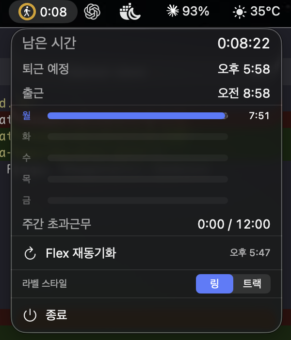
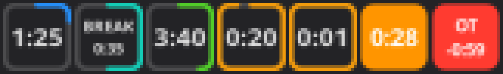

# 칼퇴타이머 (FlexTimer)

A macOS menu bar timer that reads your flex.team clock-in and counts down to
칼퇴 — with a Linux tray port sharing the same core. Built for a Korean office's
flex-time rules: an 8-hour target, a fixed lunch window, a weekly overtime cap,
and a family day that shortens the last Friday of the month.



## The label

 

A glyph, a countdown, and a fill that closes as the countdown runs down — both
above with minutes left, so the fill is nearly complete, amber, and the glyph
has started walking. Two geometries, chosen under `라벨 스타일`: a **ring** around
the glyph, or a **track** capsule filling behind the whole label.

| Phase | Reads | Meaning |
| --- | --- | --- |
| To lunch | `fork.knife` `1:20` | counting to 11:20 — lunch start, less the 10-minute allowance |
| On break | `cup.and.saucer` `0:45` | inside the 11:20–12:30 window |
| Counting | `timer` `2:34` | clocked in, counting to leave time |
| Nearly 칼퇴 | `figure.walk` `0:24` | the last 30 minutes |
| 자유! | `figure.walk.departure` `자유!` | the first minute past target |
| Overtime | `flame` `+1:00` | today's overtime |
| Settled | `checkmark` `+1:00` | clocked out — settled, not necessarily target met |
| Weekend | `beach.umbrella` `주말!` | the timer stands down |

Two details the fill gets right, and they are the interesting part:

- **It gauges the number beside it.** The morning fills toward lunch, the break
  toward resumption, the afternoon toward leave time — so a full fill always
  means the countdown has reached `0:00`. It restarts twice a day, at 11:20 and
  12:30.
- **Its colour tracks the whole day regardless** — blue → teal → green → amber
  — so a nearly-closed morning ring is still morning-blue and cannot be read as
  a finished day. Past target it goes flat orange, and red at a company limit.

## The dropdown

남은 시간 leads, then 퇴근 예정 and 출근, the week strip, and 주간 초과근무
against the 12h cap.

**The week strip** gives each weekday its own bar: accent-coloured to that
day's target, orange past it, hours worked on the right. The track spans the
week's longest target, so a full bar means the day is done and no space sits
reserved for overtime nobody worked — and when a day *does* run over, all five
rescale together so they stay comparable.

**Shortened days** — approved time off and family day both cut the target,
which moves 퇴근 예정 earlier with nothing on screen to explain it. A caption
then names the cause: `Target 4:00 · family day, time off`.

## Linux

The portable `KaltoeCore` logic compiles into a headless `kaltoe-core` daemon,
fronted by a Python tray (`linux/kaltoe-tray.py`). Both desktops show the same
progress the Mac ring does, in the shape each has room for.

KDE has no label field in its tray, so the countdown is drawn *into* the icon
and its outline is the progress:



GNOME puts the countdown beside a small icon — the Mac's exact layout — so the
icon gets a ring instead:


Neither is a mockup: both are the shipped renderer's output through
`--render-test` / `--render-ring`, resampled to a real 22px panel.

## Build

```bash
swift test                  # 237 tests
./scripts/bundle.sh         # build/칼퇴타이머.app, signed
./scripts/build-linux.sh    # Docker; build/kaltoe-timer-linux-x86_64.tar.gz
```

Requires macOS 26+. Install by copying the bundle to `/Applications`; it adds
itself to Login Items on first launch and respects you turning that off.

Creating a self-signed `kaltoe-dev` certificate once stops macOS treating every
rebuild as a new app and re-asking for keychain access — see
[docs/reference.md](docs/reference.md).

## More

- [docs/reference.md](docs/reference.md) — settings, clock-in/out hooks,
  overtime arithmetic, the Flex endpoints, and the tray render tests
- [docs/flex-api.md](docs/flex-api.md) — endpoint shapes and how to re-capture
  them if flex.team changes
- [docs/설치가이드-INSTALL-GUIDE.md](docs/설치가이드-INSTALL-GUIDE.md) — install
  guide for a recipient, English and Korean

The repository contains no personal data: fixtures are synthetic, and each
user's Flex id is discovered from their own session at sign-in.
